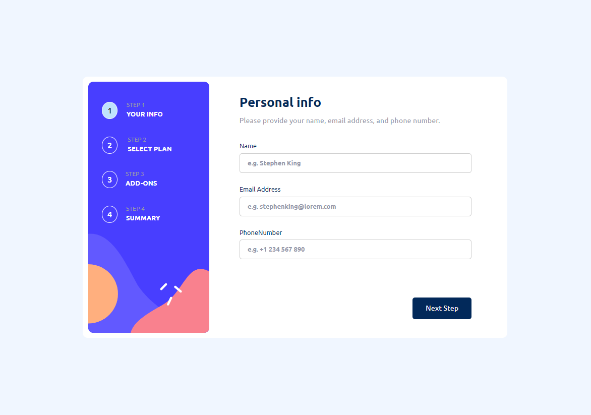
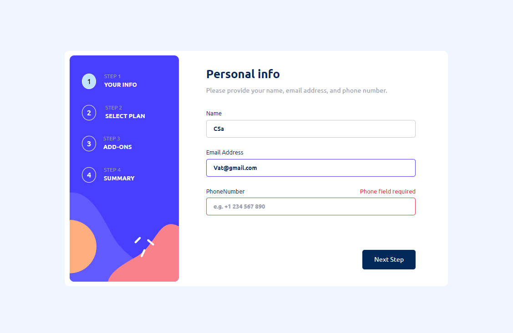
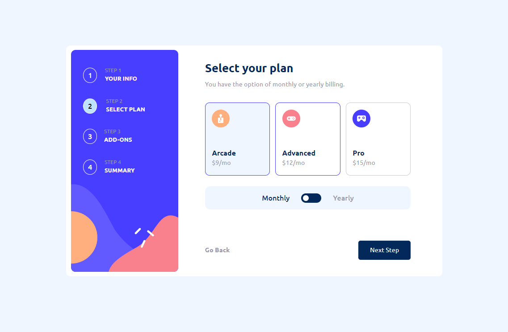
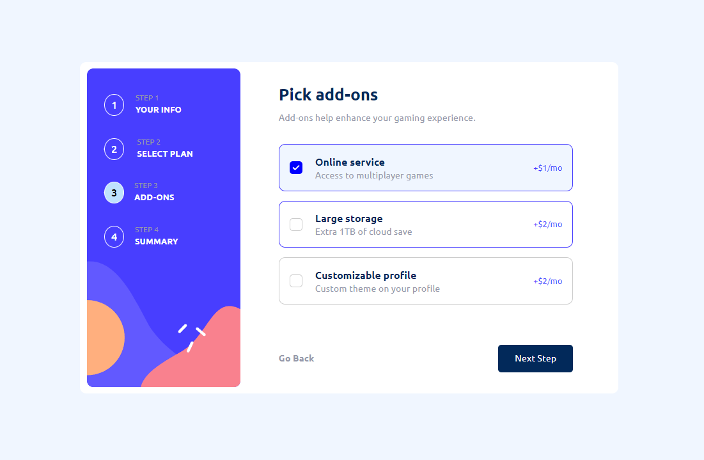
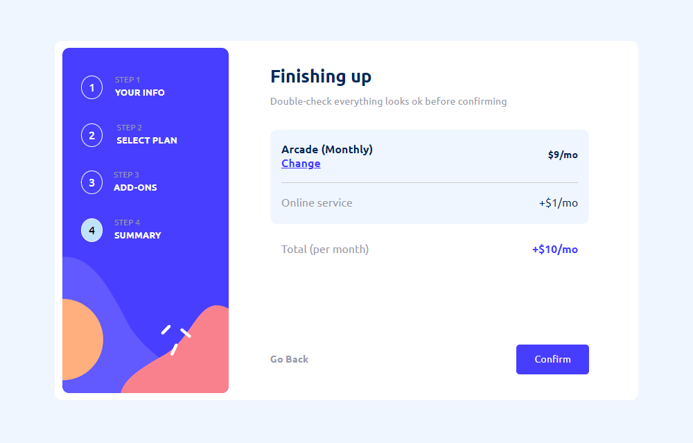
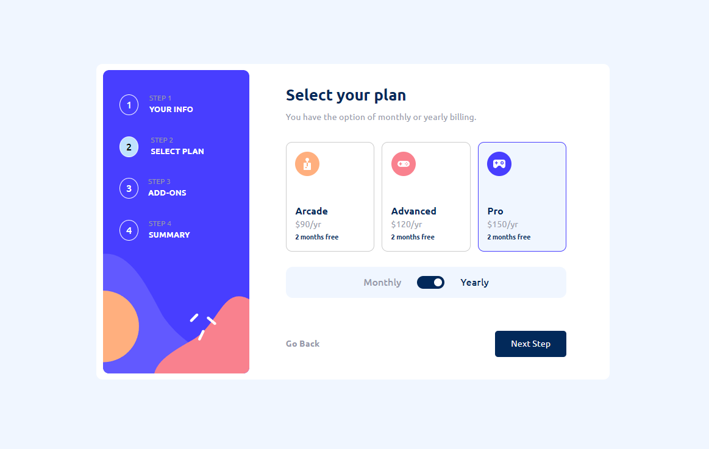
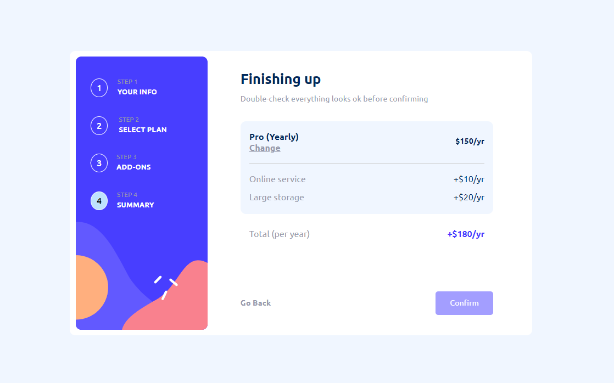
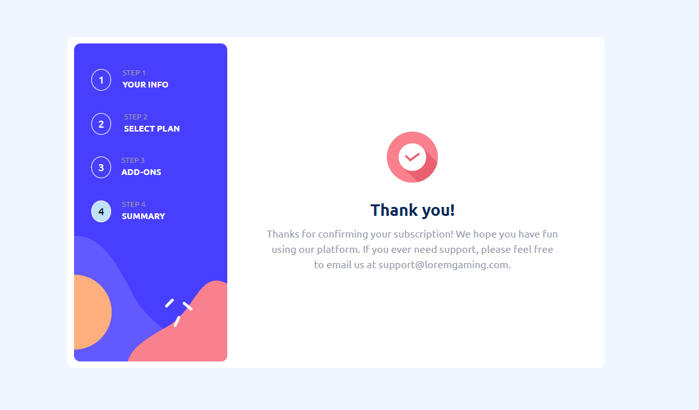

# Responsive Multi-step form with animated steps

## Overview

### The challenge

Users should be able to:

- Complete each step of the sequence
- Go back to a previous step to update their selections
- See a summary of their selections on the final step and confirm their order
- View the optimal layout for the interface depending on their device's screen size
- See hover and focus states for all interactive elements on the page
- Receive form validation messages if:
  - A field has been missed
  - The email address is not formatted correctly
  - Phone number dont match with specific country code
  - Name field dont match min or max length

### Screenshot

### Links

- Solution URL: [https://github.com/TANJIRWEBDEV/Responsive_news_homepage](https://github.com/TANJIRWEBDEV/Responsive-Multi-step-form)
- Live Site URL: https://coruscating-mermaid-b549c4.netlify.app/

## My process

### Built with

- Semantic HTML5 markup
- CSS custom properties
- Flexbox
- CSS Grid
- [React](https://reactjs.org/) - JS library

## Author

- Website - https://github.com/TANJIRWEBDEV
- Frontend Mentor - https://www.frontendmentor.io/profile/TANJIRWEBDEV
- Twitter - https://twitter.com/TanWevDev
